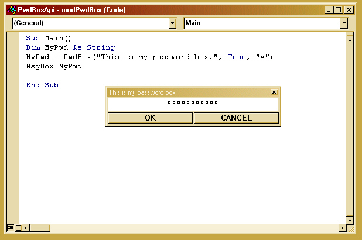



## API Password Box

### Description

All API-driven masked user input function. Works similiar to the "InputBox" function. The form and all controls are generated by API, so there is no need to include special forms when you want to have a user put text into a masked edit control. Enjoy!
 
### More Info
 

             |
---                |---
**Submitted On**   |2002-10-10 07:35:28
**By**             |[Dave Andrews](https://github.com/Planet-Source-Code/PSCIndex/blob/master/ByAuthor/dave-andrews.md)
**Level**          |Advanced
**User Rating**    |4.8 (29 globes from 6 users)
**Compatibility**  |VB 6\.0
**Category**       |[Libraries](https://github.com/Planet-Source-Code/PSCIndex/blob/master/ByCategory/libraries__1-49.md)
**World**          |[Visual Basic](https://github.com/Planet-Source-Code/PSCIndex/blob/master/ByWorld/visual-basic.md)
**Archive File**   |[API\_Passwo14385510102002\.zip](https://github.com/Planet-Source-Code/dave-andrews-api-password-box__1-39702/archive/master.zip)

